# CS2040DE Data Structures and Algorithms

# Lab 6: Graph Theory, BFS

<div align="center">

</div>


<div align="center">
<table style="border-collapse: collapse; margin: 0 auto;">
<tr><td align="center" style="font-size: 24px;"><strong>National University of Singapore</strong></td></tr>
<tr><td align="center" style="font-size: 24px;"><em>Academic Year 2024/25 Semester 2</em></td></tr>
<tr><td align="center" style="font-size: 16px; padding-top: 10px;">Hitesh (B03) and Zikun (B01 & B04)</td></tr>
<tr><td align="center" style="font-size: 14px;"><em>Materials adapted from: Xiaoyang, Hitesh, Yurui</em></td></tr>
</table>
</div>


## Learning Objectives

By the end of this lab, students should be able to:

- [1] Recap about graph properties
- [2] Recap about graph representations (i.e., edge list, adjacency list, adjacency matrix)
- [3] Learn about how ro implement BFS in Java
- [4] Do a question relating to BFS in Java
- [5] (Optional) Get other questions from previous labs answered
- [6] (Optional) Find more practice problems to do if they wish

## Recap about Graph Properties

In two-dimensional coordinates, two points can be connected to form a line, and multiple points connected by lines form a graph. Of course, a graph can also consist of just a single node, or even have no nodes (an empty graph).

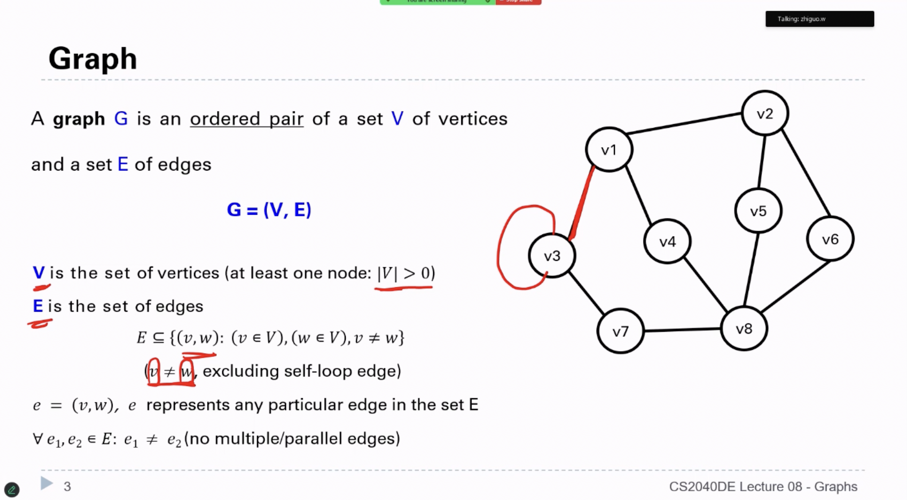


Overall, graphs are generally classified into directed graphs and undirected graphs.
A directed graph is one where the edges in the graph have direction.
An undirected graph is one where the edges in the graph have no direction.

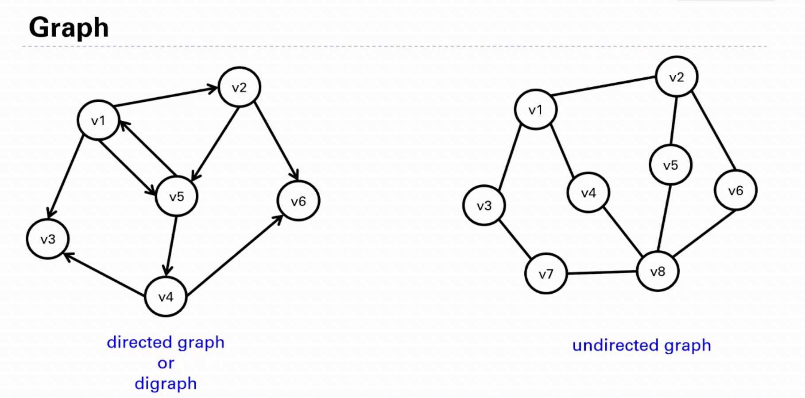


A weighted directed graph is one where the edges in the graph have weight values. A weighted undirected graphis one where the edges in the graph have no weight values (or you can think of it that they have the same weight values).

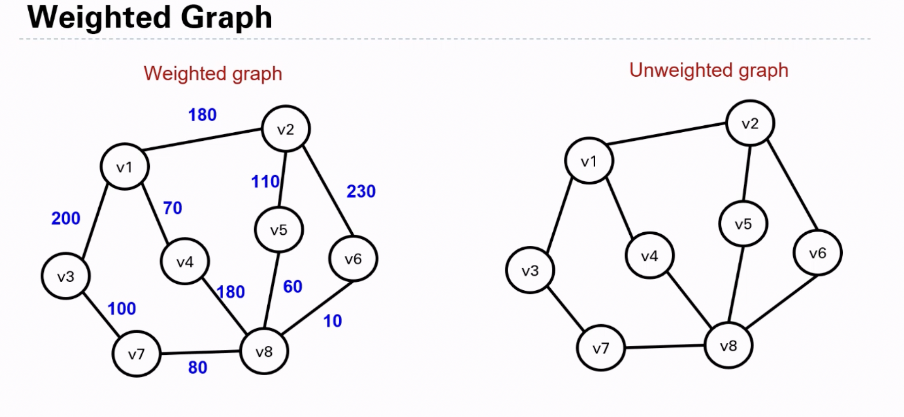


A graph can be sparse or dense (relative definition).

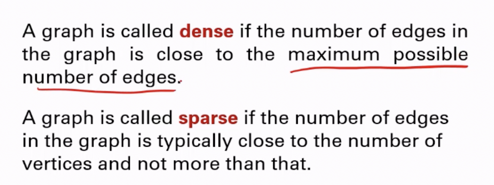


## Recap about Graph Representations

How do we represent a graph in code?

Generally, adjacency lists, adjacency matrices, or edge lists are used for representation. 

### Edge List

If we use an edge list to store the following unweighted graph:

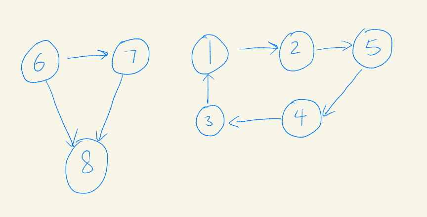

What we will do is that since this graph has 8 edges, we define an 8 × 2 array, meaning we allocate an array of size n × 2 for n edges, like this:


The first row of the array: 6 7, indicates that node 6 points to node 7, and so on.

Of course, instead of arrays, maps or classes can also be used to represent these edge relationships.

The advantage of this representation method is that it is intuitive, making it easy to display the relationships between nodes. 

However, if we want to know whether node 1 and node 6 are connected, we need to enumerate the entire storage space. This is an obvious disadvantage. Additionally, we would not use this storage method for BFS or DFS. This is because during searches, we need to know the connection status between a node and other nodes, and with this edge list approach, we would need to enumerate everything to determine connection status.

Question: What if we want to store a weighted graph in an edge list?

Answer: For a weighted graph, the edge list would need to be extended to include the weight information. Instead of an n × 2 array, you would use an n × 3 array, where:

- The first column represents the source node
- The second column represents the destination node
- The third column represents the weight of the edge

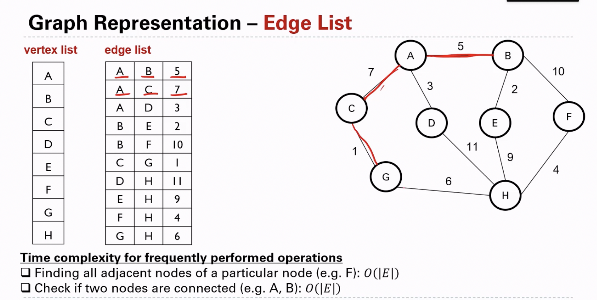

### Adjacency Matrix

Adjacency Matrix uses a two-dimensional array to represent the graph structure. 

The adjacency matrix represents the graph from the perspective of nodes, allocating a two-dimensional array as large as the number of nodes. 

For example: `grid[2][5] = 6` indicates that node 2 connects to node 5 in a directed graph, meaning node 2 points to node 5 with an edge weight of 6. 

To represent an undirected graph, we would have: `grid[2][5] = 6`, `grid[5][2] = 6`, indicating that node 2 and node 5 are mutually connected with a weight of 6:


In a graph with V (number of vertices) equal to 8, we need to allocate a space as large as 8 * 8. 

The graph has one bidirectional edge, namely: `grid[2][5] = 6, grid[5][2] = 6`. This expression method (adjacency matrix), in situations with few edges but many nodes, will result in allocating an excessively large two-dimensional array, causing waste of space. 

Moreover, when determining all connections between nodes, it is necessary to traverse the entire adjacency matrix in the worst case, resulting in a time complexity of $O(V^2)$ and thus causing unnecessary inefficiency.

Advantages of adjacency matrix:

- Simple expression method, easy to understand
- Very fast operation for checking whether an edge exists between any two vertices
- Suitable for dense graphs; in graphs where the number of edges approaches the square of the number of vertices, adjacency matrix is a space-efficient representation method.

Disadvantages:

- With sparse graphs, it will lead to allocating an excessively large two-dimensional array causing waste of space, and when traversing edges, the entire V * V matrix needs to be traversed, causing waste of time.

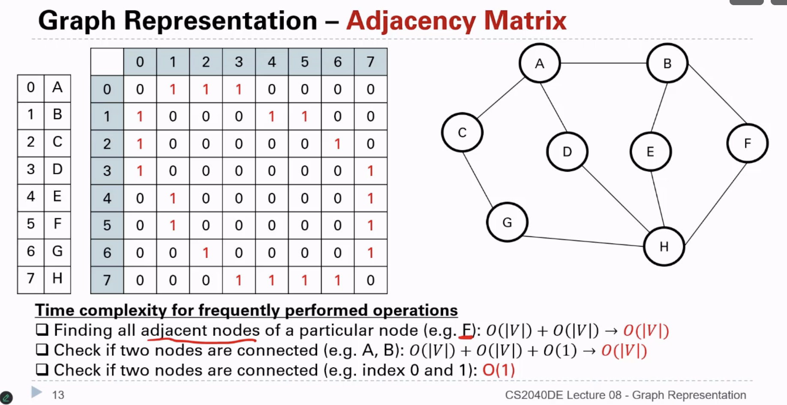

### 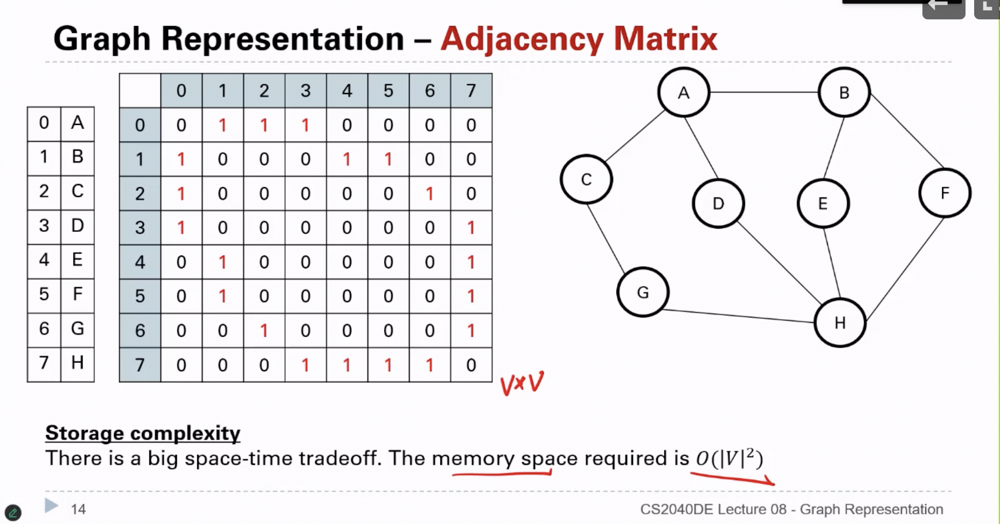

### Adjacency List

### 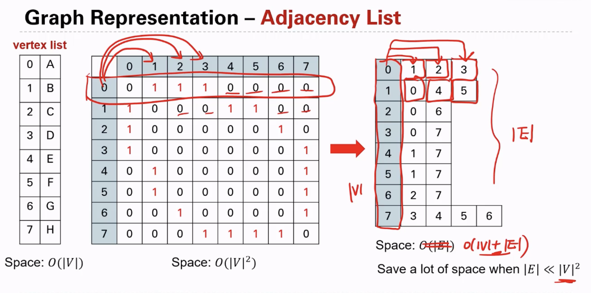

Adjacency List uses an array + linked list approach for representation. The adjacency list represents the graph based on the number of edges, allocating linked lists of corresponding size only for as many edges as there are.

The structure of an adjacency list is shown in the figure:

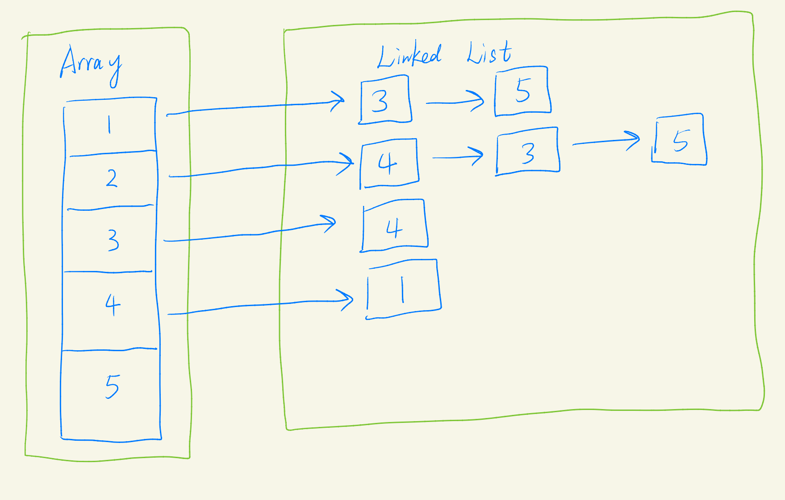

This graph expresses:

- Node 1 points to Nodes 3 and 5
- Node 2 points to Nodes 4, 3, and 5
- Node 3 points to Node 4
- Node 4 points to Node 1

The adjacency list only allocates as many linked list nodes as there are edges. From the figure, we can intuitively see how an array + linked list is used to express edge connections.

Advantages of adjacency list:

- For sparse graph storage, only edges need to be stored, resulting in high space utilization
- Traversing node connection situations is relatively easy

Disadvantages:

- Checking whether an edge exists between any two nodes is relatively inefficient, requiring O(V) time, where V represents the number of connections from a particular node to other nodes
- Implementation is relatively complex and not easily understood

### **Graph Traversal Methods**

There are basically two main categories of graph traversal methods:

- Depth-First Search (DFS)
- Breadth-First Search (BFS)

When discussing the binary tree chapter, these two traversal methods were actually already covered. Recursive traversal of binary trees is the DFS traversal method applied to binary trees. Level-order traversal of binary trees is the BFS traversal method applied to binary trees. Note that a tree is a special kind of graph.

DFS and BFS are search algorithms that can be performed on different data structures. In the binary tree chapter, they were used to search on binary tree data structures. In the graph theory chapter, they are used to search on graphs (adjacency lists or adjacency matrices).

#### Breadth-First Search (BFS)

#### 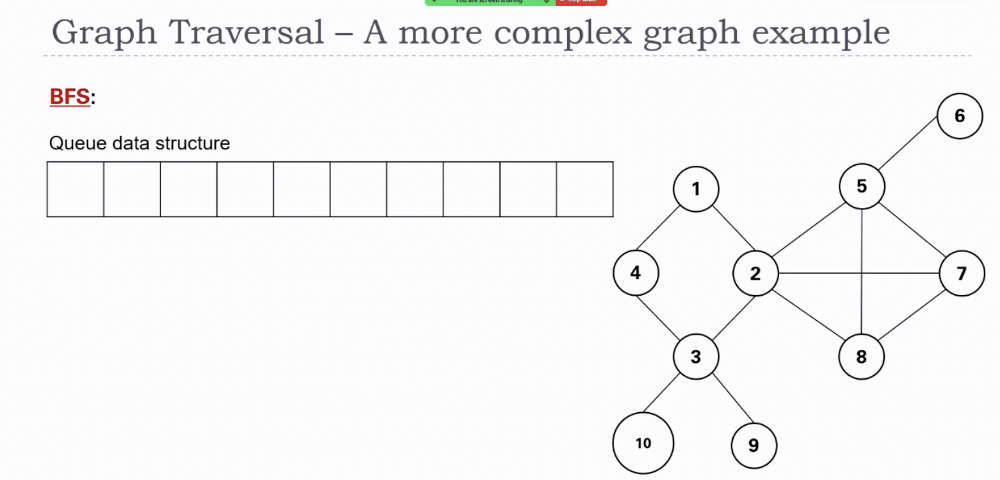

BFS explores the graph level by level, ensuring all neighbours of a node are visited before moving to the next level. BFS can be implemented iteratively using a **queue**.

##### The Problem

Imagine you have a map represented as a grid (like a chess board or maze). You're standing at one position and want to explore the entire area by visiting all the accessible squares. The challenge is to visit each location exactly once and cover the entire accessible area efficiently.

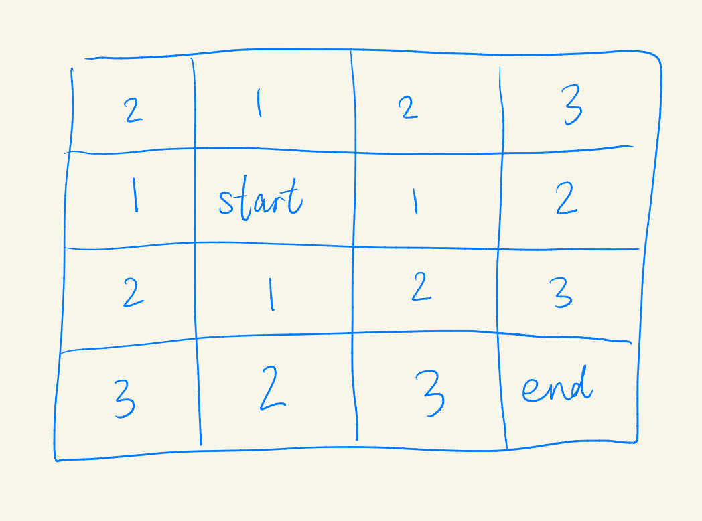

##### The Solution: Breadth-First Search (BFS)

BFS is like dropping a pebble in water and watching the ripples spread outward in perfect circles. Here's how it works:

1. **Start at one point**: You begin at a specific location (x,y) on the grid.
2. **Explore in waves**: Instead of going as far as possible in one direction, you explore all immediate neighbors first (right, down, left, up).
3. **Keep track of visited locations**: You mark each spot you've visited so you don't revisit it.
4. **Use a queue to remember where to go next**: A queue is like a line at a store - first person in is the first person out (FIFO).

```java
public class GridTraversal {
    // Represents four directions: right, down, left, up
    private static final int[][] DIRECTIONS = {{0, 1}, {1, 0}, {-1, 0}, {0, -1}};
    
    /**
     * Performs breadth-first search on a 2D grid starting from coordinates (x, y)
     * 
     * @param grid The map represented as a 2D array
     * @param visited Marks visited nodes to prevent revisiting
     * @param x Starting x-coordinate for search
     * @param y Starting y-coordinate for search
     */
    public void bfs(char[][] grid, boolean[][] visited, int x, int y) {
        Queue<int[]> queue = new LinkedList<>();
        queue.offer(new int[]{x, y});      // Add starting node to queue
        visited[x][y] = true;              // Mark as visited immediately when added to queue
        
        while (!queue.isEmpty()) {         // Begin traversing elements in the queue
            int[] current = queue.poll();  // Get element from queue
            int currentX = current[0];     // Current node coordinates
            int currentY = current[1];     // Current node coordinates
            
            // Traverse in all four directions (right, down, left, up) from current node
            for (int i = 0; i < 4; i++) {
                int nextX = currentX + DIRECTIONS[i][0];    // Get coordinates of adjacent directions
                int nextY = currentY + DIRECTIONS[i][1];    // Get coordinates of adjacent directions
                
                // Skip if coordinates are out of bounds
                if (nextX < 0 || nextX >= grid.length || nextY < 0 || nextY >= grid[0].length) {
                    continue;
                }
                
                // If node hasn't been visited
                if (!visited[nextX][nextY]) {
                    queue.offer(new int[]{nextX, nextY});  // Add node to queue for next round of traversal
                    visited[nextX][nextY] = true;          // Mark as visited immediately to avoid duplicate visits
                }
            }
        }
    }
}
```

Question: What is being used to store the graph?

## Similarities and Differences: Binary Tree Level Order Traversal vs. Graph BFS

### Similarities

1. **Queue Usage**: Both use a queue data structure to maintain the processing order, following the first-in-first-out principle.
2. **Level-by-Level Processing**: Both explore elements in a level-by-level manner, completely finishing the current level before moving to the next.
3. **Visit Tracking**: Both need to keep track of which nodes have been processed.
4. **Breadth-First Approach**: Both prioritize breadth over depth, exploring all neighbors before diving deeper.
5. Core Algorithm: Both follow the same general pattern:
   - Add starting node(s) to the queue
   - While queue isn't empty:
     - Dequeue a node
     - Process it
     - Enqueue its unvisited neighbors

### Differences

1. Visited Marking:
   - **Tree**: No need for a separate "visited" structure because trees have no cycles
   - **Graph**: Requires explicit tracking of visited nodes to prevent infinite loops
2. Node Connections:
   - **Tree**: Each node has well-defined children (usually left and right)
   - **Graph**: Nodes can have arbitrary connections to any number of neighbors
3. Direction of Edges:
   - **Tree**: Edges only go from parent to children (top-down)
   - **Graph**: Edges can be directed or undirected and form any pattern
4. Node Discovery:
   - **Tree**: Children are directly accessible from parent nodes
   - **Graph**: Neighbors must be discovered by checking adjacency list/matrix/grid
5. Implementation Complexity:
   - **Tree**: Simpler, no need to check for cycles
   - **Graph**: More complex, requiring cycle detection
6. Structure Guarantees:
   - **Tree**: Has a single root, no cycles, connected
   - **Graph**: Can have multiple components, cycles, no defined "root"

These differences explain why the graph BFS implementation requires additional mechanisms like the `visited` array, while tree traversal can be more straightforward.

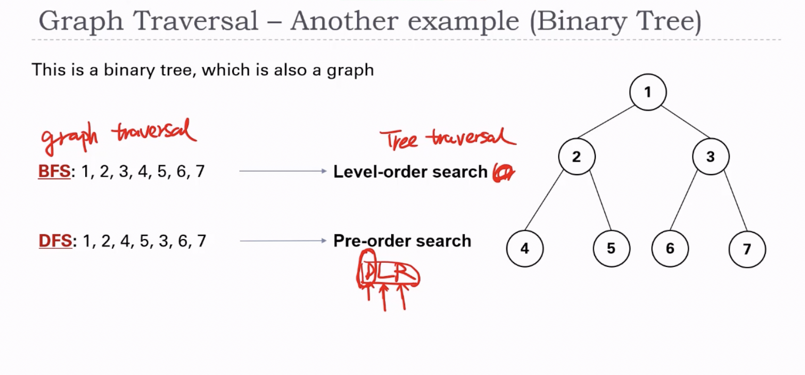

# Optional Questions From Previous Semester

Q1: [Number of Islands](https://leetcode.com/problems/number-of-islands/)

Q2: [Eight Queens](https://open.kattis.com/contests/y663i8/problems/8queens)

Q3: [Pokémon Ice Maze](https://open.kattis.com/contests/jq4f7h/problems/pokemon)

Q4: [N-Puzzle](https://open.kattis.com/contests/hfypyp/problems/npuzzle)

Q5: [Cut the Negativity](https://open.kattis.com/problems/cutthenegativity)

Q6: [99 Problems](https://open.kattis.com/contests/v52uty/problems/99problems)

Q8: [Sannvirði](https://open.kattis.com/contests/a9izeq/problems/sannvirdi)

Q9: [Send More Money](https://open.kattis.com/contests/yoatkk/problems/sendmoremoney)

Q10: [Counting Stars](https://open.kattis.com/contests/x8uu2t/problems/countingstars)
